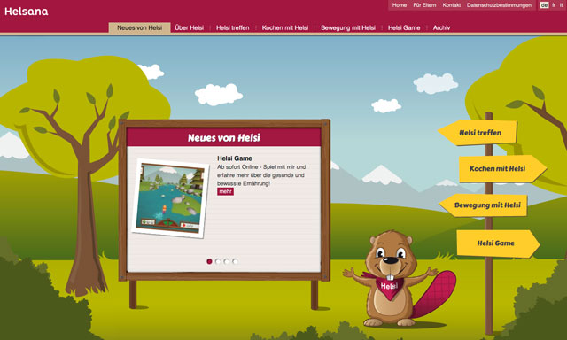
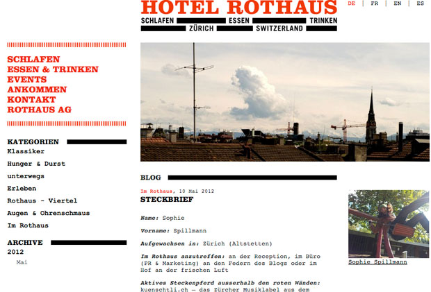
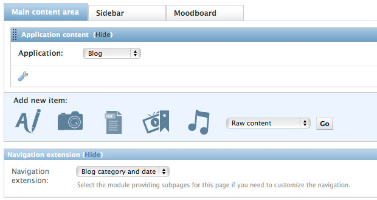

.. _widgets:

============
Blog Widgets
============

Widgets are a way tho show blog content outside of the main app. There are two ways of doing this:
Using content types or template tags.

Here we are going to describe some use-cases and how to implement them:

Teaser blog entries and FeinCMS pages on the landingpage
========================================================

For a landing page that uses its own temlate anyway it makes sense to use a template tag.
Elephantblog comes with a template library called 'blog_widgets' that provides the function
get_frontpage which you could use like this::

    

    

        
        <h1 id="helsinews"></h1>
        

            
            

                
            

            
        

    

In this particular case we used the pageteaser content form the FeinCMS Contenttype Box Vol.1.
That one allows to combine FeinCMS pages and blog entries.
We also added a 'Teaser' region to both pages so the user can define manually what content
is displayed.

Adding categories or date breakdown to FeinCMS page navigation
==============================================================

It is possible to add blog entries directly into the FeinCMS navigation path when using the blog
as ApplicationContent. You need to activate the navigation extensions for FeinCMS::

    Page.register_extensions('navigation', 'seo', 'titles', 'translations')

On the page where you add the 'Blog' ApplicationContent, also select a navigation extension

In this example we used the CategoryAndDateNavigationExtension.
